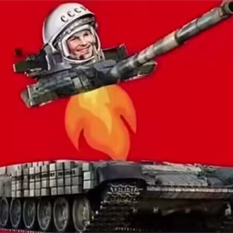

# 机械动力火炮：载人航天
### Create Big cannon:Artillery-Powered Space Program

> 💡 灵感来自《战争雷霆》 · Вдохновлено игрой War Thunder · Inspired by War Thunder

---

## 中文

### 简介
《机械动力火炮：载人航天》是《机械动力》(Create) 与《机械动力：火炮》(Create Big Cannons) 的兼容扩展 mod，**弹药殉爆机制灵感来自《战争雷霆》(War Thunder)**。

它修复了 CBC 军事补充包 (CBCMS, `cbcmoreshells`) 的水套弹药架与 CBC 现代战争 (CBCMW, `cbcmodernwarfare`) 中炮弹药之间的交互问题，并加入弹药殉爆机制。

### 功能
- **动力臂装填修复**：动力臂现在可以从水套弹药架中取出/放入 CBCMW 中炮弹药。
- **红石弹种选择修复**：水套弹药架由红石信号控制的弹种选择支持 CBCMW 弹药。
- **弹药殉爆**（灵感来自战争雷霆）：
  - 装有弹药的弹药架或置物台被任意 CBC 系炮弹直接命中或接触必定殉爆（弹射物接触引爆），被任意爆炸波及也必定殉爆（直接命中不再有概率只打坏本体而不殉爆）；
  - **威力由弹种与数量决定**：迫击石弹、穿甲弹、脱壳穿甲弹等没有炸药的弹头不会殉爆；高爆弹、破甲弹等殉爆威力更大；CBCMW 中型弹药全部会殉爆；
  - 数量越多威力越大，最高达到基础威力的 **2 倍**（半径按立方根换算）；
  - 殉爆弹药的特殊效果也会触发：烟雾弹释放烟幕、燃烧弹引发火焰；
  - 面包学 (Mianbaos Modern Warfare) 与 Vestalihy 的导弹/火箭发射器及飞行中的导弹被命中也会殉爆（威力稍小）；飞行中导弹被破片命中也会殉爆；空发射器不会殉爆；
  - 任何携带 CBC 类弹药（包括发射药）的**生物（不止玩家）**死亡时都会殉爆，威力规则与弹药架相同；
  - 车万女仆联动：女仆死亡殉爆时会计入其背包中的全部 CBC 弹药（不只手中的）；修复置物台上的发射药（Powder Charge）不殉爆的问题；
  - Sable 联动：殉爆会对爆炸范围内的 Sable 子层级结构造成结构损伤，爆炸位置会正确映射到结构的世界位置，可伤及主世界与相邻结构。
  - 修复弹药架连环殉爆导致游戏崩溃的问题。

### 安装
1. 安装下方的前置 mod。
2. 将仓库根目录的 `cbcmsmwcompat-2.0.1.jar` 放入对应游戏实例的 `mods` 文件夹。
3. 首次启动后生成配置文件：`world/serverconfig/cbcmsmwcompat-server.toml`。

### 前置要求
- Minecraft 1.21.1，NeoForge ≥ 21.1.233
- Create ≥ 6.0.10（< 6.1.0）
- Create Big Cannons ≥ 5.11.7
- CBC-Military-Supplement ≥ 2.1.0
- cbcmodernwarfare ≥ 0.0.6v
- 可选：mianbaos_modernwarfare ≥ 2.3.0（面包学联动）
- 可选：vestalihy ≥ 2.5.2（Vestalihy 联动）
- 可选：sable-neoforge ≥ 2.0.3（Sable 结构损伤联动）
- 可选：车万女仆 Touhou Little Maid（女仆背包殉爆）

### 构建
在 PowerShell 中运行 `build.ps1`。脚本会自动定位装有 CBCMW、CBCMS、Create、CBC 5.11.7 与航空学修复 mod 的游戏实例，解包 Create 的 jar-in-jar 依赖，使用 Minecraft 自带 Java 运行时编译并打包。

---

## Русский

### Описание
«Create Big cannon: Artillery-Powered Space Program» — это аддон для Create и Create Big Cannons. **Механика детонации боезапаса вдохновлена игрой War Thunder.**

Мод исправляет взаимодействие стеллажей с водяным охлаждением из CBC Military Supplement (CBCMS, `cbcmoreshells`) с боеприпасами среднего калибра из CBC Modern Warfare (CBCMW, `cbcmodernwarfare`) и добавляет механику детонации боезапаса.

### Возможности
- **Исправлена загрузка механической рукой**: рука может доставать и класть боеприпасы CBCMW в стеллажи с водяным охлаждением.
- **Исправлен выбор типа снаряда**: переключение снарядов по сигналу редстоуна поддерживает боеприпасы CBCMW.
- **Детонация боезапаса** (вдохновлена War Thunder):
  - стеллаж или депо с боеприпасами гарантированно детонирует при прямом попадании или контакте любого снаряда семейства CBC (контактный подрыв снаряда) и при взрывной волне (прямое попадание больше не может просто разрушить блок без детонации);
  - **мощность зависит от типа и количества снарядов**: каменные мортирные ядра, бронебойные и подкалиберные снаряды без взрывчатки не детонируют; фугасные и кумулятивные снаряды детонируют с повышенной мощностью; все средние боеприпасы CBCMW детонируют;
  - чем больше боеприпасов, тем выше мощность — до **2 раз** от базовой (радиус растёт по кубическому корню);
  - срабатывают и особые эффекты: дымовые снаряды дают дымовую завесу, зажигательные — огонь;
  - пусковые установки ракет Mianbaos Modern Warfare и Vestalihy, а также ракеты в полёте детонируют при попадании (мощность ниже); летящая ракета детонирует и от осколков; пустые пусковые установки не детонируют;
  - **любое существо (не только игрок)**, несущее боеприпасы CBC (включая метательный заряд), детонирует при смерти по тем же правилам;
  - интеграция с Touhou Little Maid: при гибели горничной учитываются все боеприпасы CBC в её рюкзаке, а не только в руках; исправлено отсутствие детонации метательного заряда на депо;
  - интеграция с Sable: взрыв наносит структурный урон постройкам Sable в радиусе взрыва и корректно переносится в мировые координаты конструкции, повреждая основной мир и соседние постройки.
  - исправлен вылет игры при цепной детонации стеллажей.

### Установка
1. Установите зависимости (см. ниже).
2. Скопируйте `cbcmsmwcompat-2.0.1.jar` из корня репозитория в папку `mods` нужного экземпляра игры.
3. После первого запуска создаётся конфиг: `world/serverconfig/cbcmsmwcompat-server.toml`.

### Требования
- Minecraft 1.21.1, NeoForge ≥ 21.1.233
- Create ≥ 6.0.10 (< 6.1.0)
- Create Big Cannons ≥ 5.11.7
- CBC-Military-Supplement ≥ 2.1.0
- cbcmodernwarfare ≥ 0.0.6v
- Опционально: mianbaos_modernwarfare ≥ 2.3.0, vestalihy ≥ 2.5.2, sable-neoforge ≥ 2.0.3, Touhou Little Maid

### Сборка
Запустите `build.ps1` в PowerShell. Скрипт сам найдёт игровой экземпляр с нужными модами, распакует jar-in-jar библиотеки Create, скомпилирует и упакует мод.

---

## English

### About
Create Big cannon: Artillery-Powered Space Program is an add-on for Create and Create Big Cannons. **Its ammunition cook-off mechanics are inspired by War Thunder.**

It fixes interaction between the water-jacketed ammo racks from CBC Military Supplement (CBCMS, `cbcmoreshells`) and medium cannon ammunition from CBC Modern Warfare (CBCMW, `cbcmodernwarfare`), and adds ammunition cook-off mechanics.

### Features
- **Mechanical arm loading fix**: Create mechanical arms can now load and unload CBCMW medium cannon ammunition from water-jacketed ammo racks.
- **Redstone shell selection fix**: the racks' redstone-controlled shell selection also cycles CBCMW ammunition.
- **Ammunition cook-off** (inspired by War Thunder):
  - a rack or depot holding ammunition always cook offs when directly hit by or touched by any CBC-family projectile (projectile contact detonation) or caught in any explosion blast (a direct hit can no longer just break the block without a cook-off);
  - **power depends on shell type and quantity**: non-explosive warheads such as mortar stone, AP and APFSDS shots do not cook off; HE/HEAT-class shells cook off at increased power; all CBCMW medium ammunition cooks off;
  - the more ammunition stored, the bigger the blast, up to **2x the base power** (radius scales with the cube root);
  - special effects trigger too: smoke shells release a smoke cloud, incendiary shells spread fire;
  - missile/rocket launchers and in-flight missiles from Mianbaos Modern Warfare and Vestalihy also detonate when hit (slightly weaker); in-flight missiles detonate from fragments too; empty launchers do not detonate;
  - **any mob (not just players)** carrying CBC-family ammunition (including propellant) detonates on death, following the same rules;
  - Touhou Little Maid integration: a maid's death cook-off counts all CBC ammunition in her backpack, not just what she holds; fixed propellant (Powder Charge) on depots not cooking off;
  - Sable integration: cook-off blasts deal structural damage to Sable sub-level structures within the blast radius and are projected to the structure's world position, damaging the main world and neighbouring structures.
  - fixed a crash caused by chain cook-offs between racks.

### Install
1. Install the dependencies listed below.
2. Drop `cbcmsmwcompat-2.0.1.jar` from the repository root into the `mods` folder of your game instance.
3. After the first launch a config file is generated: `world/serverconfig/cbcmsmwcompat-server.toml`.

### Requirements
- Minecraft 1.21.1, NeoForge ≥ 21.1.233
- Create ≥ 6.0.10 (< 6.1.0)
- Create Big Cannons ≥ 5.11.7
- CBC-Military-Supplement ≥ 2.1.0
- cbcmodernwarfare ≥ 0.0.6v
- Optional: mianbaos_modernwarfare ≥ 2.3.0 (Mianbaos integration)
- Optional: vestalihy ≥ 2.5.2 (Vestalihy integration)
- Optional: sable-neoforge ≥ 2.0.3 (Sable structural damage integration)
- Optional: Touhou Little Maid (maid backpack cook-off)

### Building
Run `build.ps1` in PowerShell. The script locates the game instance containing CBCMW, CBCMS, Create, CBC 5.11.7 and the aeronautics fix, extracts Create's jar-in-jar dependencies, compiles with the bundled Minecraft Java runtime and packages the mod.

---

## 配置 / Настройка / Configuration

配置文件：`world/serverconfig/cbcmsmwcompat-server.toml`

| Key | Default | Meaning / 含义 |
| --- | --- | --- |
| `loading_fix.enabled` | `true` | 动力臂装填修复 / исправление загрузки рукой / arm loading fix |
| `cook_off.directHitEnabled` | `true` | 被直接命中殉爆 / детонация при прямом попадании / cook-off on direct hit |
| `cook_off.blastEnabled` | `true` | 被爆炸波及殉爆 / детонация от взрывной волны / cook-off in explosion blast |
| `cook_off.depotEnabled` | `true` | 置物台殉爆 / детонация депо / depot cook-off |
| `cook_off.explosionCount` | `3` | 单次殉爆爆炸次数 (1-10) / число взрывов / explosions per cook-off |
| `cook_off.explosionInterval` | `4` | 爆炸间隔 (tick) / интервал между взрывами / ticks between explosions |
| `cook_off.explosionJitter` | `1.5` | 爆炸随机偏移 / случайное смещение / max random offset |
| `cook_off.power.baseRadius` | `10.0` | 基础爆炸半径 / базовый радиус взрыва / base explosion radius |
| `cook_off.power.maxMultiplier` | `2.0` | 殉爆威力最大倍率 / максимум мощности / max power multiplier |
| `cook_off.power.weightStandard` | `1.0` | 普通弹药的威力权重 / вес обычных снарядов / standard shell weight |
| `cook_off.power.weightExplosive` | `2.0` | 高爆/破甲弹的威力权重 / вес фугасных снарядов / HE warhead weight |
| `cook_off.power.weightPropellant` | `1.0` | 发射药的威力权重 / вес метательного заряда / propellant weight |
| `cook_off.power.weightSpecial` | `1.0` | 特种弹（烟雾）的威力权重 / вес специальных снарядов / special shell weight |
| `cook_off.power.specialEffects` | `true` | 触发烟雾/火焰特效 / особые эффекты / trigger special effects |
| `cook_off.fire` | `false` | 是否生成火焰 / создавать ли огонь / create fire |
| `cook_off.mobDeathEnabled` | `true` | 携带弹药的生物死亡殉爆 / детонация существ при смерти / mob death cook-off |
| `cook_off.sableEnabled` | `true` | Sable 子层级结构损伤 / структурный урон Sable / Sable sub-level damage |

---

## 灵感来源 / Вдохновение / Inspiration

弹药殉爆机制（弹药架、置物台、发射器、飞行中导弹与死亡生物身上的弹药在命中或爆炸波及下起爆）的灵感来自《战争雷霆》(War Thunder)。

Механика детонации боезапаса вдохновлена игрой War Thunder.

The ammunition cook-off mechanics are inspired by War Thunder.

---

License: MIT (see `LICENSE`)